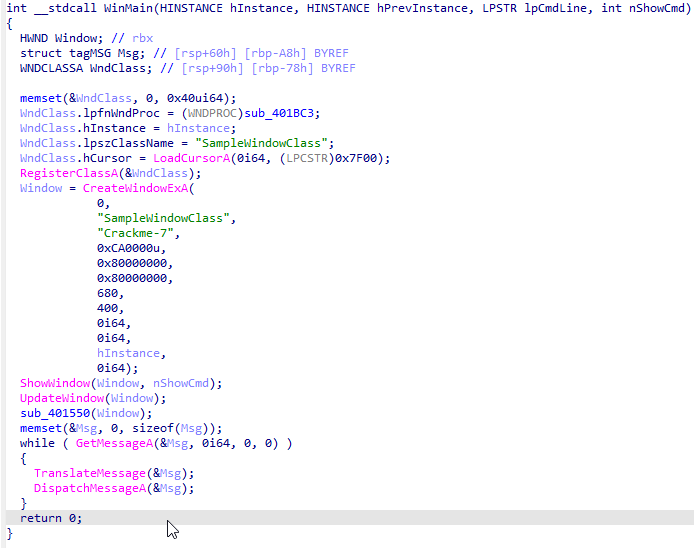
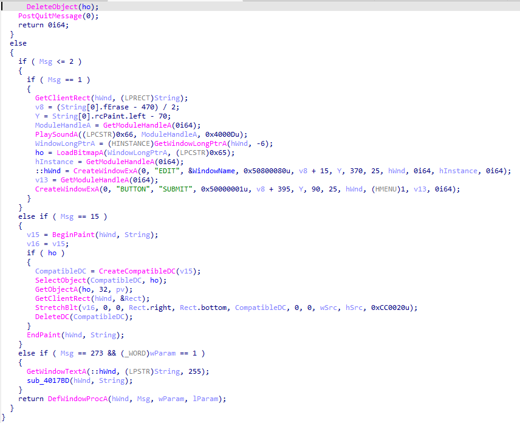
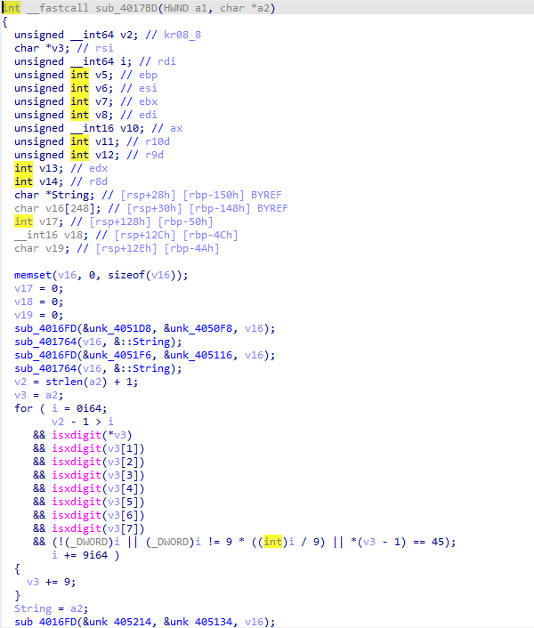
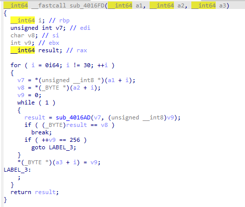
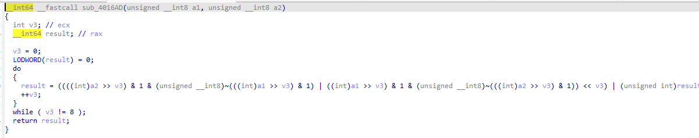
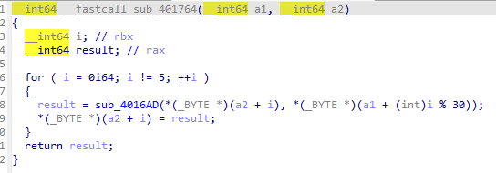
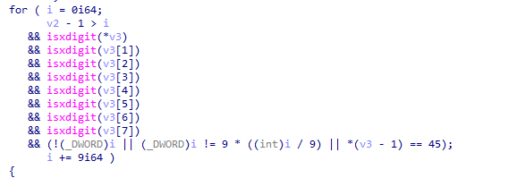
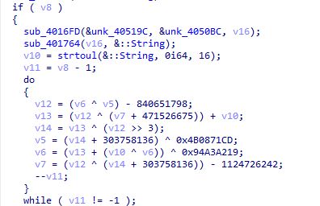
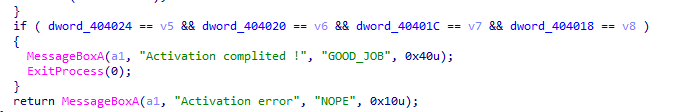
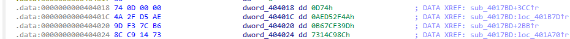

# Crackme 2

## Логика программы

Открывая бинарь в IDA основную логику программы мы видим не сразу, так как программа представляет собой графическое Windows-приложение. Точкой входа служит стандартная функция WinMain, которая регистрирует окно Crackme-7. Вся работа с интерфейсом завязана на оконную процедуру sub_401BC3



Когда пользователь нажимает кнопку SUBMIT, оконная процедура ловит сообщение WM_COMMAND, считывает введенный текст из поля ввода с помощью GetWindowTextA и мгновенно передает эту строку аргументом в функцию sub_4017BD. 



Вот именно в этой функции основная логика и находится



Первой встречается функция sub_4016FD, в ней ещё есть функция sub_4016AD. На вход первой подаются массивы unk_405214 и unk_405134. Их содержимое:

<b>unk_405214</b>\
`2D E2 A2 86 DD B4 93 15 1B BD 97 6A E4 27 68 64 67 3A 74 27 18 74 00 61 05 8C 53 86 32 4E 00 00 00 00 00 00 00 00 00 00 00 00 00 00`

<b>unk_405134</b>\
`D2 DD 99 95 A2 7D 72 CA EB 18 7F 44 8B B1 02 DB E3 95 A5 F0 0C C5 8E 79 1E 63 9C 2D E9 8D 00 00 00 00 00 00 00 00 00 00 00 00 00 00`

В самой функции sub_4016FD идёт цикл на 30 повторений (как раз в этих массивах 30 байт, всё остальное заполнено незначащими нулями). Она берет по байту из каждого массива и вызывает для них функцию sub_4016AD (цикл от 0 до 255). 



Зайдя в неё видно, что в ней происходит побитовая операция XOR как раз для тех двух байт массивов.



То есть по итогу функция расшифровывает скрытую строку методом брутфорса каждого символа, пока не подберёт такое значение от 0 до 255, которое при XOR с байтом из первого массива даст байт из второго массива. И это сохраняется в v16 и передается дальше

Передается в sub_401764. В цикле из 5 итераций v16 накладывается на глобальный буфер String. 



И вот здесь забегу вперед, ибо заметил странность при решении. У нас всё время ксорится этот глобальный буфер, а v16 остаётся неизменным. К моменту v10 = strtoul(&::String, 0i64, 16); у нас глобальный буфер String содержит не изначальное значение, так как XOR происходит 7 раз. Когда вводишь верный флаг, то в первый раз выводится Activation Error, а на второй раз Activation Complited. Я думаю это связано с тем, что когда нажимаешь второй раз SUBMIT, то XOR в сумме происходит 14 раз (чётное количество раз, т.е возвращается к исходному состоянию), то глобальный буфер String возвращается к исходному состоянию и цикл проходит нормально

Далее с помощью strtoul строка разбивается на четыре 32-битных шестнадцатеричных числа: v5, v6, v7 и v8. Шаблон ввода строго проверяется на формат XXXXXXXX-XXXXXXXX-XXXXXXXX-XXXXXXXX



Четвертый блок ключа (v8) напрямую определяет количество раундов основного цикла и равен 0x0D74 (это мы узнаем из финальной проверки, значение dword_404018. в десятичной системе 3444 раза)

Если v8 не равен нулю, программа запускает цикл do-while, в котором над первыми тремя блоками (v5, v6, v7) выполняются побитовые сдвиги >> 3, сложение, вычитания и XOR-операции



```
v12 = (v6 ^ v5) - 840651798;
v13 = (v12 ^ (v7 + 471526675)) + v10;
v14 = v13 ^ (v12 >> 3);
v5 = (v14 + 303758136) ^ 0x4B0871CD;
v6 = (v13 + (v10 ^ v6)) ^ 0x94A3A219;
v7 = (v12 ^ (v14 + 303758136)) - 1124726242;
```
По завершении всех 3444 раундов полученные значения сверяются с эталонными константами, жестко зашитыми в секции данных .data:

v5 сравнивается с dword_404024 (8C C9 14 73)\
v6 сравнивается с dword_404020 (9D F3 7C B6)\
v7 сравнивается с dword_40401C (4A 2F D5 AE)\
v8 сравнивается с dword_404018 (74 0D 00 00)




И самая прелесть в том, что для получения флага нам надо взять лишь эти константы и провернуть ту кучу операций над ними в обратном порядке (v8 не надо, она зашита). И вот тут всплывает v10 и глобальный буфер String. Для правильных расчётов надо симулировать переполнение регистров и v10 объявлена как число на 2 байта, а глобальный буфер (FC2A8D94A5) явно больше двух байт (хотя почему-то если в коде задавать v10 = 0x94A5, то выдаёт неверный флаг, а если представить, что обнуляется, то всё верно)

```
from ctypes import c_uint32

state = [0x7314C98C, 0xB67CF39D, 0xAED52F4A]
rounds = 0x0D74

for _ in range(rounds):

    x = c_uint32((state[2] + 1124726242) ^ (state[0] ^ 0x4B0871CD)).value
    y = c_uint32(((state[0] ^ 0x4B0871CD) - 303758136) ^ (x >> 3)).value

    next_B = c_uint32(((state[1] ^ 0x94A3A219) - y) ^ 0).value
    next_A = c_uint32((x + 840651798) ^ next_B).value
    next_C = c_uint32(((y - 0) ^ x) - 471526675).value

    state = [next_A, next_B, next_C]

flag = f"{state[0]:08X}-{state[1]:08X}-{state[2]:08X}-{rounds:08X}"
print(flag)
```

[И тут тоже](1.py)

c_uint32 симулирует как раз переполнение 
